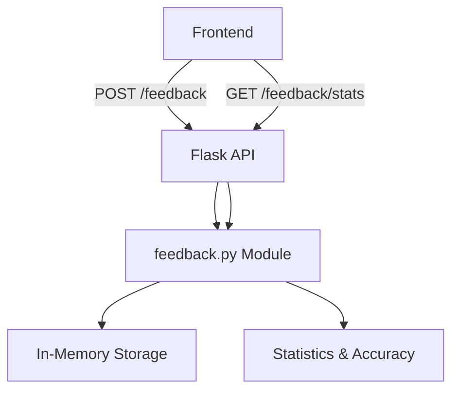

# Feedback Tracking Implementation Plan

## Overview
Create a feedback system to track user satisfaction with Karin's responses, calculating accuracy/satisfaction scores and displaying total questions asked.

## Requirements
- **Storage**: In-memory (simple, good for testing)
- **Feedback Types**: Like, Dislike, Neutral (no feedback)
- **Frontend Integration**: Frontend sends feedback via API
- **Metrics**: Calculate satisfaction accuracy percentage

## Architecture



## Implementation Details

### 1. Create `feedback.py` Module
**File**: `feedback.py`

```python
# In-memory storage for feedback
feedback_data = {
    "likes": 0,
    "dislikes": 0,
    "neutrals": 0,
    "total_questions": 0
}

def update_feedback(rating):
    """Update feedback counts based on user rating."""
    # rating: "like", "dislike", or "neutral"
    pass

def get_feedback_stats():
    """Return feedback statistics including accuracy calculation."""
    pass

def calculate_accuracy():
    """Calculate satisfaction accuracy: likes / (likes + dislikes) * 100"""
    pass
```

### 2. Add API Endpoints to `app.py`

**POST /feedback** - Receive feedback from frontend
```json
Request Body: { "rating": "like" | "dislike" | "neutral" }
Response: { "success": true }
```

**GET /feedback/stats** - Return feedback statistics
```json
Response: {
    "likes": 10,
    "dislikes": 2,
    "neutrals": 5,
    "total_questions": 17,
    "accuracy": 83.33,
    "satisfaction_rate": 66.67
}
```

### 3. Accuracy Calculation
- **Accuracy**: `(likes / (likes + dislikes)) * 100` - How many users found it helpful
- **Satisfaction Rate**: `(likes / total_questions) * 100` - Overall user satisfaction

## Files to Create/Modify

| File | Action | Description |
|------|--------|-------------|
| `feedback.py` | Create | New module for feedback tracking |
| `app.py` | Modify | Add `/feedback` and `/feedback/stats` endpoints |

## API Usage Examples

### Send Feedback
```bash
curl -X POST http://localhost:8000/feedback \
  -H "Content-Type: application/json" \
  -d '{"rating": "like"}'
```

### Get Statistics
```bash
curl http://localhost:8000/feedback/stats
```

## Response Example
```json
{
  "likes": 45,
  "dislikes": 5,
  "neutrals": 20,
  "total_questions": 70,
  "accuracy": 90.0,
  "satisfaction_rate": 64.29
}
```

## Next Steps
1. Create the `feedback.py` module
2. Update `app.py` with new endpoints
3. Test with sample feedback
4. Frontend can now integrate with these endpoints

---
*Plan created for Karin Backend Project*
